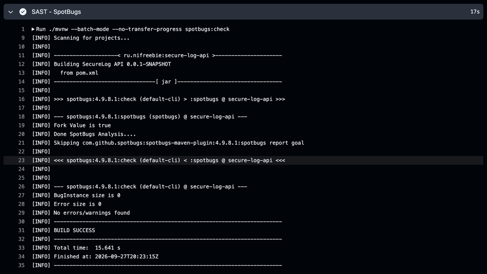
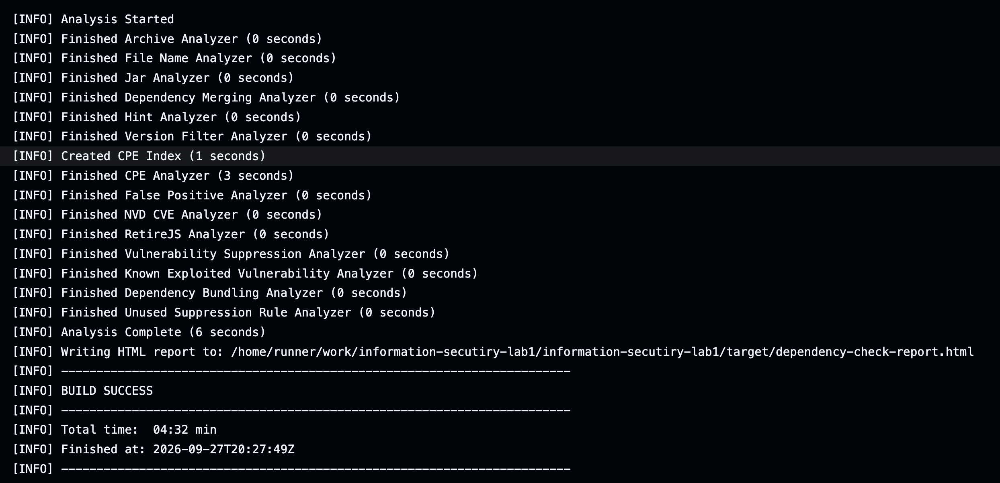

## Структура пакетов

```text
ru.nifreebie.infoseclab1
├── controller  # REST-контроллеры и обработка ошибок
├── dto         # объекты запросов и ответов API
├── model       # JPA-сущности и енамы
├── repository  # Spring Data JPA репозитории
├── security    # JWT и конфигурация Spring Security
├── service     # бизнес-логика
└── utils       # исключения
```

## API

### Регистрация

`POST /auth/register`

```bash
curl -i -X POST http://localhost:8080/auth/register \
  -H 'Content-Type: application/json' \
  -d '{
    "username": "student",
    "password": "StrongPassword123!"
  }'
```

Ответ `201 Created` содержит UUID созданного пользователя:

```json
{
  "id": "f38275b4-aa2b-4b70-aaf7-63ceee5b66c4",
  "username": "student"
}
```

Имя пользователя должно содержать от 3 до 50 букв латинского алфавита, цифр или символов `.`, `_`, `-`. Пароль должен содержать от 12 до 64 символов, строчную и заглавную буквы, цифру и специальный символ.

### Вход

`POST /auth/login`

```bash
curl -i -X POST http://localhost:8080/auth/login \
  -H 'Content-Type: application/json' \
  -d '{
    "username": "student",
    "password": "StrongPassword123!"
  }'
```

Ответ `200 OK`:

```json
{
  "token": "eyJhbGciOiJIUzI1NiIsInR5cCI6IkpXVCJ9...",
  "tokenType": "Bearer",
  "expiresIn": 3600
}
```

Скопируйте значение `token` в переменную для следующих запросов:

```bash
export TOKEN='полученный-JWT'
```

### Создание лога

`POST /api/logs` — защищённый эндпоинт.

```bash
curl -i -X POST http://localhost:8080/api/logs \
  -H "Authorization: Bearer $TOKEN" \
  -H 'Content-Type: application/json' \
  -d '{
    "level": "WARNING",
    "source": "authentication-service",
    "message": "Failed login attempt",
    "eventTime": "2026-09-27T12:30:00Z"
  }'
```

Допустимые уровни: `INFO`, `WARNING`, `ERROR`. `eventTime` не может находиться в будущем. Ответ `201 Created` содержит UUID созданного лога:

```json
{
  "id": "2b8ed33f-e649-47b1-90a6-d2e64ff458ac",
  "level": "WARNING",
  "source": "authentication-service",
  "message": "Failed login attempt",
  "eventTime": "2026-09-27T12:30:00Z",
  "createdAt": "2026-09-27T12:30:01Z"
}
```

### Получение логов

`GET /api/logs` — возвращает только логи текущего пользователя, сначала самые новые.

```bash
curl -i http://localhost:8080/api/logs \
  -H "Authorization: Bearer $TOKEN"
```

Проверка запрета анонимного доступа:

```bash
curl -i http://localhost:8080/api/logs
```

Сервер должен вернуть `401 Unauthorized`.

## Реализованные меры защиты

### Защита от SQL-инъекций

Доступ к данным реализован через Spring Data JPA. Репозитории формируют параметризованные запросы, а пользовательские значения не объединяются со строками SQL. В приложении нет SQL, построенного конкатенацией строк.

### Защита от XSS

Поля `source` и `message` проходят проверку длины, а перед включением в ответ экранируются методом `HtmlUtils.htmlEscape`. Например, `<script>` возвращается как `&lt;script&gt;`. Ответы имеют тип `application/json`; Content Security Policy запрещает загрузку какого-либо контента.

### Защита аутентификации

- Пароли хранятся только как BCrypt-хэши с cost factor 12.
- JWT подписываются алгоритмом HMAC-SHA-256 и содержат `sub`, UUID пользователя, издателя, время создания и истечения.
- Подпись сравнивается за константное время; проверяются алгоритм, издатель и срок действия.
- Срок JWT по умолчанию — один час и ограничен диапазоном от 60 секунд до 24 часов.
- Секрет подписи длиной не менее 32 байт поступает только из `JWT_SECRET`.
- Сервер не создаёт HTTP-сессии; каждый защищённый запрос проверяется JWT-фильтром.
- Ошибка входа одинакова для несуществующего пользователя и неверного пароля.

### Контроль доступа и дополнительная защита

- Каждый лог связан с UUID владельца; выборка всегда ограничивается текущим пользователем.
- DTO проверяются Jakarta Bean Validation: ограничения длины, формата, обязательности и времени события.
- Неизвестные уровни логирования и некорректный JSON дают безопасный ответ `400`.
- Внешнему клиенту не возвращаются stack trace, SQL, хэши паролей или внутренние исключения.
- Добавлены security headers: `X-Content-Type-Options`, запрет отображения во frame и строгая CSP.
- CSRF отключён обоснованно: API не использует cookies или сессии для аутентификации, JWT передаётся явно в заголовке `Authorization`.

## SAST и SCA локально

Статический анализ:

```bash
./mvnw spotbugs:check
```

Отчёт создаётся в `target/spotbugsXml.xml`.

Проверка зависимостей:

```bash
./mvnw dependency-check:check
```

HTML-отчёт создаётся в `target/dependency-check-report.html`. Первая загрузка базы NVD без API key может занять продолжительное время. Для CI рекомендуется добавить секрет репозитория `NVD_API_KEY` и передавать его Dependency-Check.

Сборка падает, если OWASP Dependency-Check обнаруживает уязвимость с CVSS 7.0 или выше.

## CI/CD

Workflow [`.github/workflows/ci.yml`](.github/workflows/ci.yml) запускается при каждом `push` и создании или обновлении pull request. Он выполняет:

1. компиляцию и интеграционные тесты;
2. SAST с помощью SpotBugs;
3. SCA с помощью OWASP Dependency-Check;
4. загрузку отчётов как artifact `security-reports`, даже если один из сканеров сообщил об ошибке.

## Скриншоты проверок





Ссылка на последний успешный pipeline:

```text
https://github.com/USERNAME/REPOSITORY/actions/runs/RUN_ID
```
